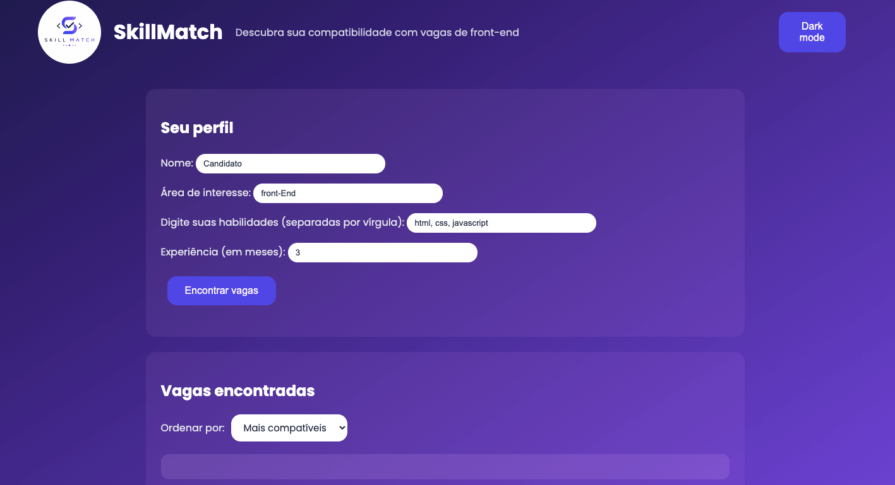
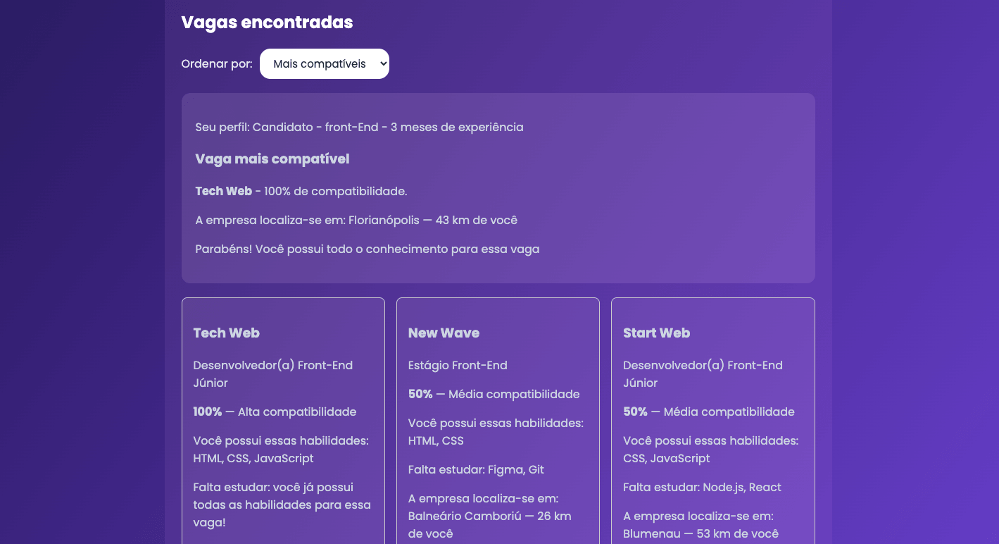
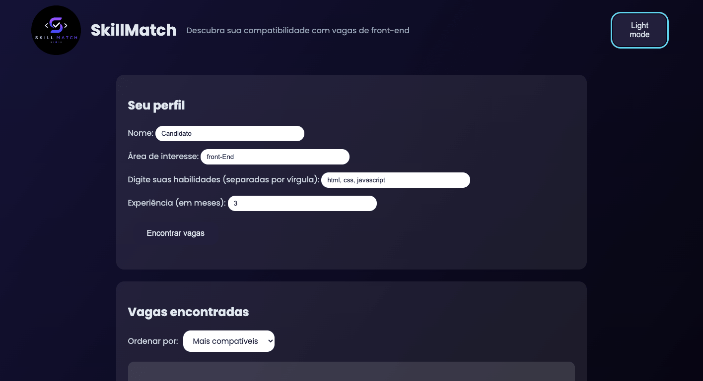
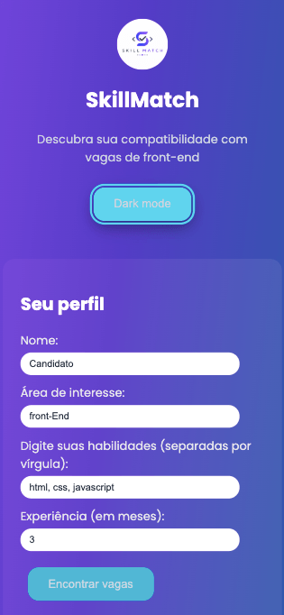
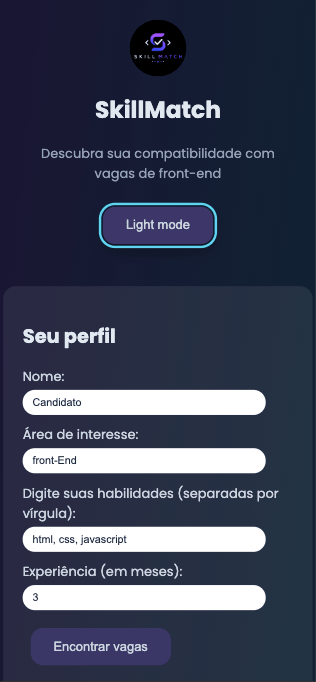

# SkillMatch Web

O **SkillMatch Web** é uma aplicação web front-end que analisa a compatibilidade entre o perfil de um candidato e vagas de desenvolvimento front-end júnior.

A partir das habilidades informadas pelo usuário, o sistema calcula o percentual de compatibilidade com cada vaga, identifica a vaga mais compatível, mostra quais habilidades o candidato já possui e quais precisa desenvolver e recomenda o que estudar. O objetivo é ajudar pessoas em início ou transição de carreira a entenderem onde estão em relação ao mercado e como se preparar.

## Tecnologias e técnicas utilizadas

### Tecnologias
- **HTML5** 
- **CSS3** 
- **JavaScript** 

### Técnicas e conceitos aplicados
- **Programação Orientada a Objetos:** classes `Vaga` e `VagaFrontEnd` (herança com `extends`/`super`)
- **Módulos ES:** código separado em `main`, `motor`, `ui`, `dados` e `funcionalidades`
- **Funções de alta ordem:** `map`, `filter`, `reduce`, `some`, `sort`
- **Closure:** contador de análises realizadas
- **Callback:** comunicação entre o formulário e o main
- **Assincronismo:** `fetch`, `async/await` e `Promises`
- **Persistência:** `localStorage` (com `JSON.stringify`/`parse`)
- **Manipulação do DOM:** criação dinâmica dos cards
- **Web APIs:** Geolocation (distância até as vagas)
- **Acessibilidade e SEO:** labels, ARIA, foco visível, meta tags
- **Responsividade:** design mobile-first com temas distintos para desktop e mobile

## Como executar o projeto

Como o projeto utiliza módulos ES e `fetch`, é necessário rodá-lo através de um servidor local (não basta abrir o arquivo HTML diretamente no navegador).

### Pré-requisitos
- [Visual Studio Code](https://code.visualstudio.com/)
- Extensão **Live Server** instalada no VS Code

### Passos
1. Clone o repositório:
   ```
   git clone https://github.com/aline-volpatto/skillmatch-web.git
   ```
2. Abra a pasta do projeto no VS Code
3. Clique com o botão direito no arquivo `index.html`
4. Selecione **"Open with Live Server"**
5. O projeto abrirá no navegador (geralmente em `http://127.0.0.1:5500`)

> Para usar a funcionalidade de geolocalização, o navegador pedirá permissão de localização — basta permitir.

## Funcionalidades

- **Análise de compatibilidade:** o candidato informa nome, área, habilidades e experiência, e o sistema calcula o percentual de compatibilidade com cada vaga.
- **Destaque da melhor vaga:** identifica e destaca a vaga mais compatível com o perfil.
- **Recomendação de estudo:** mostra quais habilidades faltam para cada vaga.
- **Ordenação:** o usuário pode ordenar as vagas por compatibilidade ou por proximidade.
- **Geolocalização:** calcula e exibe a distância entre o candidato e cada vaga.
- **Tema claro/escuro:** alternância de tema, com preferência salva no navegador.
- **Persistência de perfil:** os dados do candidato são lembrados ao recarregar a página.
- **Design responsivo:** layout adaptado para desktop e mobile, com esquemas de cores distintos.


## Prints 

### Tela inicial


### Resultados da Pesquisa


### Dark Mode - Desktop


### Light Mode - Mobile


### Dark Mode - Mobile


## Referências e fontes de estudo

- Lógica de Programação e Algoritmos com JavaScript, de Edécio Fernando Iepsen
- Materiais didáticos disponibilizados pelo programa SCTEC (SENAI/SC)
- Anotações pessoais desenvolvidas ao longo do curso

## Uso de Inteligência Artificial

Durante o desenvolvimento deste projeto, utilizei uma IA (assistente do Claude) como ferramenta de mentoria e apoio ao aprendizado.

A IA foi usada para:
- Tirar dúvidas sobre conceitos (POO, closures, async/await, módulos ES, etc.)
- Ajudar a identificar e entender a causa de erros (depuração)
- Revisar trechos de código e sugerir boas práticas
- Explicar o "porquê" de cada solução, e não apenas fornecer respostas prontas

Todo o código foi digitado e compreendido por mim, adaptando as orientações ao meu contexto. Utilizei a IA como uma mentora que me ajudava a aprender, garantindo que eu entendesse cada parte do que estava construindo — inclusive sendo capaz de explicar o funcionamento de todo o código no vídeo de apresentação.

## Links

- 🔗 **Repositório:** https://github.com/aline-volpatto/skillmatch-web
- 📋 **Board do Trello:** https://trello.com/b/r37jZqwz/skillmatch-web
- 🎥 **Vídeo de apresentação:** https://drive.google.com/file/d/19fkVQ_OKa-1xGcdvTwVYnzPAR5L5HAUS/view?usp=drive_link

## Autora

**Aline Volpatto**
Projeto desenvolvido para o programa SCTEC Carreira Tech - Desenvolvedor Web Front-End
SENAI/SC · 2026

